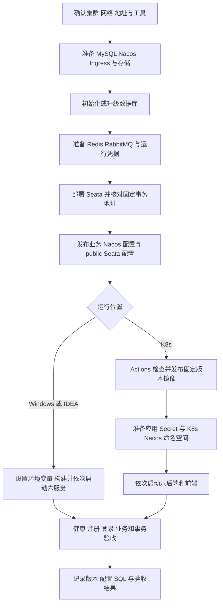

# LuckyH Cloud 部署流程与新增业务模块准备说明文档

> 本文由 AI 根据当前仓库自动整理，生成日期：2026-10-03（Asia/Shanghai）。
> 代码基线：`codex/k8s-applications`，HEAD `0a59ef3`，包含当前工作树中的中间件和日志配置改动。
> 本次仅静态核对源码、配置、SQL、脚本及现有文档，没有执行构建、配置发布、SQL、集群部署或业务请求。原文档的 2026-10-02 验收记录属于历史记录，不能代替本次部署验收。
> 2026-10-04 发布说明补充：现有环境已由 Fleet 管理，后端监听 `master`、前端监听 `codex/luckyh-cloud-web`。默认分支推送会发布镜像并更新 GitOps 清单，随后由 Fleet 部署；仅上传代码时应使用其他功能分支。本文件的直接 apply / set image 示例仅用于未交由 Fleet 管理的环境，不用于现有 Fleet 应用。

## 1. 先选择操作路径

| 你的目标 | 执行范围 |
| --- | --- |
| 全新环境首次部署 | 第 3～8 节，基础设施 → 数据库 → 中间件 → Seata → Nacos → 镜像 → 应用 → 验收 |
| 在已有 K8s 环境更新版本 | 第 8、9 节；按变更决定是否执行 SQL、发布 Nacos、更新 Secret |
| 在 Windows / IDEA 本地开发 | 准备数据库、中间件、Seata、Nacos 后执行第 7 节；无需部署七个应用 Pod |
| 在已有业务服务内增加功能 | 第 11.1 节；通常不增加部署资源 |
| 新建独立业务服务 | 第 11.2～11.6 节；必须同步接入构建、配置、启动、发布和部署 |
| 新增公共 Maven 模块 | 第 11.7 节；由使用方打包部署 |

项目当前有六个后端应用和一个配套前端。根 Maven 项目和 `luckyh-common` 是聚合模块；四个 common 子模块是依赖库，不独立启动。

### 详细实现：完整部署流程



**四个操作要分别完成：**修改 Git 文件、发布 Nacos 配置、执行数据库脚本、更新运行中的应用。任何一个都不会自动完成其余三个。GitHub Actions 当前只发布镜像，不自动部署 K8s。

## 2. 当前环境、名称和访问链路

### 2.1 应用名称对照

| Maven 模块 / 镜像末级名称 | 运行应用名 / Nacos 服务名 / K8s Deployment 与 Service | Data ID | HTTP 端口 |
| --- | --- | --- | ---: |
| `luckyh-gateway-service` | `gateway-service` | `gateway-service.yml` | 8080 |
| `luckyh-user-service` | `user-service` | `user-service.yml` | 8081 |
| `luckyh-order-service` | `order-service` | `order-service.yml` | 8082 |
| `luckyh-auth-service` | `auth-service` | `auth-service.yml` | 8083 |
| `luckyh-inventory-service` | `inventory-service` | `inventory-service.yml` | 8084 |
| `luckyh-account-service` | `account-service` | `account-service.yml` | 8085 |
| 前端仓库 `luckyh-cloud-web` | `web` | 无后端服务 Data ID | 80 |

后端镜像前缀是 `ghcr.io/stop-bullshit/`。模块名称有 `luckyh-` 前缀，运行服务名没有该前缀。Feign、网关 `lb://`、K8s Service 和 Nacos Data ID 要分别使用对应名称。

### 2.2 命名空间不是同一件事

| 位置 | Namespace / Group | 用途 |
| --- | --- | --- |
| Kubernetes 应用 | namespace `luckyh-cloud` | 七个应用、`app-runtime-config`、`app-runtime`、`ghcr-pull` |
| Nacos 本地开发 | namespace ID `luckyh-cloud` / `DEFAULT_GROUP` | 本地配置读取和本地服务注册 |
| Nacos K8s 应用 | namespace ID `luckyh-cloud-k8s` / `DEFAULT_GROUP` | Pod 配置读取和 Pod 服务注册 |
| Nacos Seata 客户端 | public，空 namespace ID / `SEATA_GROUP` | `seataServer.properties` |
| Kubernetes 中间件 | `nacos`、`redis`、`rabbitmq`、`seata` | 各中间件运行资源与自己的 Secret |

本地与 K8s 的业务服务注册相互隔离；当前仍共用三个业务数据库、Redis、RabbitMQ 和 Seata。**Nacos 隔离不代表业务数据隔离。**如需独立测试环境，要另外准备数据库及其凭据，并根据需要隔离缓存和消息。

### 2.3 当前配置中的连接目标

| 依赖 | Windows / 局域网入口 | Pod 内入口 |
| --- | --- | --- |
| Nacos 客户端 | `192.168.10.201:8848`，还需通 `9848` | `nacos.nacos.svc.cluster.local:8848`，还需通 gRPC 端口 |
| MySQL | `192.168.10.209:3306` | 当前同为外部 MySQL `192.168.10.209:3306` |
| Redis 默认代理 | `redis-api.home:6379` → `192.168.10.202` | `redis-api.redis.svc.cluster.local:6379` |
| RabbitMQ AMQP | `rabbit-api.home:5672` → `192.168.10.204` | `rabbitmq.rabbitmq.svc.cluster.local:5672` |
| Seata 事务 | `192.168.10.203:8091` | 当前仍使用这个固定地址 |
| 网站 | 本地后端 `localhost:8080`，开发前端 `localhost:8000` | Ingress `192.168.10.200:80` / `cloud.home` |

以上来自仓库配置，换环境时必须核对实际地址。控制台域名 `nacos.home`、`redis.home`、`rabbit.home`、`seata.home` 指向 Ingress，不能用来替代中间件的数据协议入口。

K8s 请求链路为：浏览器 → Ingress `cloud` → Service `web` → Nginx → `gateway-service:8080` → Nacos 服务发现 → 业务 Pod。前端运行变量实际为 `GATEWAY_UPSTREAM=http://gateway-service:8080`，Nginx保留 `/api/...` 路径。

## 3. 部署前准备

### 3.1 工具与基础设施

| 执行位置 | 准备项 |
| --- | --- |
| Windows 开发 / 发布机 | JDK 17、Maven 3.9、PowerShell；跨机器操作需要 OpenSSH 与 `k8s-master` SSH 配置；初始化 SQL 需要 MySQL 客户端 |
| 本地镜像构建机 | Docker；前端本地开发另按配套仓库 README 准备 Node 和包管理器 |
| K8s 操作端 | 正确的 kubeconfig、kubectl；当前 Python 部署辅助脚本需要 Python 3 和 PyYAML |
| 集群 | 节点 Ready、CoreDNS 正常、`nginx` IngressClass、LoadBalancer 地址分配能力（当前使用 MetalLB）、`local-path` StorageClass |
| 外部依赖 | 已准备 MySQL 与 Nacos，以及对应账号、数据目录 / 数据库、网络访问权限 |

仓库提供 Redis、RabbitMQ、Seata和应用清单；**没有提供从零安装 Kubernetes、MetalLB、Ingress Controller、MySQL、完整 Nacos 集群的安装清单。**先由基础设施准备这些组件，再执行本文。`nacos-logging.yml` 是已有 Nacos 的局部日志更新，不能拿它首次安装 Nacos。

在目标集群 Bash 终端做只读检查：

```bash
kubectl config current-context
kubectl get nodes -o wide
kubectl get ingressclass
kubectl get storageclass
kubectl -n nacos get statefulsets,pods,services -o wide
kubectl top nodes
```

`kubectl top` 需要 metrics-server；不可用时用已有节点监控检查内存。确认当前上下文和目标集群一致。没有 `local-path` 时，按 [中间件部署文档](support/k8s/middleware.md#首次部署) 安装固定版本存储组件。

新环境应在应用启动前确认：MySQL 可达；Nacos 登录、配置 API 和服务注册可用；Pod 能解析中间件 Service DNS；应用节点能拉取 GHCR 镜像。当前辅助脚本使用固定 IP 和名称，换环境须同步检查脚本，不能只修改 YAML。

### 3.2 容量和持久化

当前应用清单七个应用合计 request 为 475m CPU / 1248Mi 内存，实际 Java RSS 高于堆。六后端当前是单副本 `RollingUpdate`，`maxSurge=1` / `maxUnavailable=0`，更新时新旧进程会重叠占用内存。

`gateway-service`、`order-service` 当前排除 `k8s-node-02`；Seata 固定在 `k8s-node-01`。换集群时核对节点名和调度约束。Redis 引导要求三个节点各有两个 Redis Pod，不能直接照搬到单节点集群。

`local-path` PVC 使用节点本地磁盘。持久化不等于备份；环境更新前保留数据库备份和必要的配置快照。应用镜像回滚不会恢复已经改变的业务数据。

## 4. 数据库初始化与升级

### 4.1 先判断新库还是已有库

| 脚本 | 全新环境 | 已有环境 |
| --- | --- | --- |
| [01-business.sql](support/sql/01-business.sql) | 执行一次，创建 `luckyh_cloud` 与认证 / 用户 / 订单 / `undo_log` 表 | 库存在时跳过；不用于重建或重置数据 |
| [02-seata.sql](support/sql/02-seata.sql) | 创建 `seata` 及四张服务端表 | 可补缺失库表和锁记录，不自动升级旧表 |
| [03-distributed-demo.sql](support/sql/03-distributed-demo.sql) | 创建库存、账户两库与各自 `undo_log` | 可补缺失库表 / 种子；不会重置已有库存余额或更新旧表结构 |
| [04-product-management.sql](support/sql/04-product-management.sql) | 新版 03 已有自增，无需另执行 | 仅在库存主键尚未自增时执行 |
| [05-order-product-id.sql](support/sql/05-order-product-id.sql) | 新版 01 已有字段和索引，无需另执行 | 仅在订单缺少 `product_id` / 索引时执行一次 |
| [06-order-lifecycle.sql](support/sql/06-order-lifecycle.sql) | 新版 01 已有时间字段和操作流水表，无需另执行 | 仅在缺少生命周期结构时执行一次 |

**首次部署执行 01 → 02 → 03。不要把 01～06 全部顺序执行。**04～06 是旧环境升级脚本，不是判断表结构后自动跳过的迁移系统。数据库脚本不创建应用账号、不授予账号权限，须另外准备。

### 4.2 首次初始化操作（Windows PowerShell）

下面采用当前应用配置的 MySQL 地址。`$dbAdmin` 改为实际有建库建表权限的账号，密码由 `-p` 交互输入。

```powershell
Set-Location D:\project\demo\luckyh-cloud
$dbHost = '192.168.10.209'
$dbPort = 3306
$dbAdmin = 'root'
mysql --no-defaults --default-character-set=utf8mb4 -h $dbHost -P $dbPort -u $dbAdmin -p --batch -e 'source D:/project/demo/luckyh-cloud/support/sql/01-business.sql'
if ($LASTEXITCODE -ne 0) { throw '01 初始化失败，停止并检查已执行内容。' }
mysql --no-defaults --default-character-set=utf8mb4 -h $dbHost -P $dbPort -u $dbAdmin -p --batch -e 'source D:/project/demo/luckyh-cloud/support/sql/02-seata.sql'
if ($LASTEXITCODE -ne 0) { throw '02 初始化失败。' }
mysql --no-defaults --default-character-set=utf8mb4 -h $dbHost -P $dbPort -u $dbAdmin -p --batch -e 'source D:/project/demo/luckyh-cloud/support/sql/03-distributed-demo.sql'
if ($LASTEXITCODE -ne 0) { throw '03 初始化失败。' }
```

已有业务库不要执行上述 01 命令。脚本中途失败时先检查已建结构，不删除库重来、不添加 `--force`。初始化操作不能依靠后续错误自动回滚之前的 DDL。

### 4.3 结构和权限验收

```sql
SELECT table_schema, table_name
FROM information_schema.tables
WHERE table_schema IN ('luckyh_cloud', 'luckyh_inventory', 'luckyh_account', 'seata')
ORDER BY table_schema, table_name;

SELECT column_name, column_type, extra
FROM information_schema.columns
WHERE table_schema = 'luckyh_cloud' AND table_name = 'order_info'
  AND column_name IN ('product_id', 'pay_time', 'cancel_time', 'refund_time');

SELECT column_name, extra
FROM information_schema.columns
WHERE table_schema = 'luckyh_inventory' AND table_name = 'inventory'
  AND column_name = 'product_id';
```

新版完整结构应有：`luckyh_cloud` 9 张表、库存 / 账户各 2 张表、Seata 4 张表。认证、用户、订单访问 `luckyh_cloud`；库存访问 `luckyh_inventory`；账户访问 `luckyh_account`；TC 使用 `seata`。检查实际运行账号能够读写所属库及 AT 的 `undo_log`。

旧环境对缺失结构执行所需的 04 / 05 / 06，执行前备份并避开进行中的订单事务。历史订单的商品 ID 不能靠商品名称猜测回填；当前代码会拒绝无法关联商品的支付。

## 5. 中间件与 Seata

本节命令是首次部署路径。已有健康组件可直接验收后跳过安装；已有集群只调整日志时执行第 10 节，保留运行中的配置与数据。

### 5.1 把部署资料复制到 master

Windows PowerShell，仓库根目录执行：

```powershell
ssh k8s-master 'mkdir -p /tmp/luckyh-deploy/support'
if ($LASTEXITCODE -ne 0) { throw '无法准备远程目录。' }
scp -r support/k8s k8s-master:/tmp/luckyh-deploy/support/
if ($LASTEXITCODE -ne 0) { throw '部署文件复制失败。' }
ssh k8s-master
```

后续本节的 Bash 命令在 master 执行：

```bash
cd /tmp/luckyh-deploy
set -euo pipefail
python3 -c 'import yaml; print("PyYAML ready")'
```

### 5.2 Redis / RabbitMQ 首次部署

先确认 StorageClass 和 MetalLB 地址池：Redis 代理 `.202`、RabbitMQ `.204`、可选 Redis 节点直连 `.205`。运行凭据由脚本首次生成，已有 Secret 会保留。

```bash
python3 support/k8s/create-middleware-secrets.py
kubectl apply -f support/k8s/redis-cluster.yml
kubectl apply -f support/k8s/rabbitmq.yml
kubectl -n redis rollout status statefulset/redis-cluster --timeout=240s
kubectl -n rabbitmq rollout status statefulset/rabbitmq --timeout=240s
python3 support/k8s/bootstrap-redis-cluster.py
kubectl apply -f support/k8s/redis-proxy.yml
kubectl -n redis rollout status deployment/redis-proxy --timeout=240s
kubectl apply -f support/k8s/redis-cluster-external.yml
kubectl apply -f support/k8s/redis-insight.yml
kubectl -n redis rollout status deployment/redis-insight --timeout=240s
python3 support/k8s/verify-middleware.py
```

Redis 普通客户端默认使用 Envoy 单端口代理、RESP2；可选直连清单不是代理模式必需项。直连 Cluster 模式须让客户端解析并连接六个节点域名 / 端口，不能只保证种子入口可达。

验收：Redis 槽位 16384、6 节点 / 3 主、cluster_state 为 ok；RabbitMQ 三节点运行、无告警。当前六个业务应用尚未引入 common-mq；准备 RabbitMQ 不等于已有业务会自动发消息。

### 5.3 Seata 首次部署

1. 确认第 4 节 `02-seata.sql` 完成，三业务库各有 `undo_log`。
2. 核对 [seata.yml](support/k8s/seata.yml)：镜像 2.0.0、数据库地址、节点、`SEATA_IP`、LoadBalancer `.203:8091`。
3. 在 `seata` namespace 创建 `seata-runtime-credentials`，包含 `DB_USERNAME`、`DB_PASSWORD`、`SEATA_CONSOLE_PASSWORD`、`SEATA_SECRET_KEY`。执行 [Seata 文档“首次创建 Secret”](support/k8s/README.md#2-首次创建-secret) 的交互创建程序；已有 Secret 保留。程序通过 stdin 创建，不需要把密码写入 YAML。
4. 应用清单并等到就绪：

```bash
kubectl apply -f support/k8s/seata.yml
kubectl -n seata rollout status deployment/seata-server --timeout=180s
kubectl -n seata get pods,services,ingress -o wide
```

5. 发布第 6 节的 public Seata 配置，检查应用能访问 `8091`。

TC 使用 file 配置和固定地址，不要求它出现在 Nacos 的服务列表。客户端是 file 注册、Nacos 配置，业务服务发现仍走 Nacos。换地址须同步 **Service LoadBalancer、`SEATA_IP`、`service.default.grouplist`**。

当前 demo 兼容配置：TC YAML `seata.transport.heartbeat=false`；客户端 public properties `transport.heartbeat=false`、TM 30000ms、RM 15000ms。它们来自不同 provider，字段前缀不要混用。修改后重启 TC 与四个客户端，详见 [事务指南](support/docs/distributed-transactions.md#当前-demo-的长回滚兼容处理)。

## 6. 发布 Nacos 配置

### 6.1 业务配置

根据运行位置建立 namespace **ID**，本地 `luckyh-cloud`，K8s `luckyh-cloud-k8s`，Group 均为 `DEFAULT_GROUP`。在控制台逐项新建 YAML Data ID，内容取自仓库：

| Data ID | 内容来源 / 职责 |
| --- | --- |
| `db-common.yml` | [公共连接参数](support/nacos/db-common.yml)：MySQL、Redis、RabbitMQ、MyBatis Plus |
| `common.yml` | [共享运行参数](support/nacos/common.yml)：日志、监控端点 |
| `gateway-service.yml` | [网关配置](support/nacos/gateway-service.yml)：路由、跨域、HTTP 超时 |
| `auth-service.yml` | [认证配置](support/nacos/auth-service.yml)：JWT |
| `user-service.yml` | [用户配置](support/nacos/user-service.yml) |
| `order-service.yml` | [订单配置](support/nacos/order-service.yml) |
| `inventory-service.yml` | [库存配置](support/nacos/inventory-service.yml)：库名 `luckyh_inventory` |
| `account-service.yml` | [账户配置](support/nacos/account-service.yml)：库名 `luckyh_account` |

应用启动会必需导入 `db-common.yml`、`common.yml` 和 `${spring.application.name}.yml`。即使服务专属配置很少，也须创建对应 Data ID。填写实际连接参数 / 外部凭据变量后发布，再回读核对内容；只保存本地文件不足以生效。

新环境尚无源 namespace 配置时先用上述文件手工发布。第 8 节脚本复制的是 **live `luckyh-cloud`** 的配置，不能替代从空环境导入仓库文件。

### 6.2 Seata 配置

在 **public（空 ID）/ `SEATA_GROUP`** 创建 `seataServer.properties`，内容取自 [配置文件](support/nacos/seataServer.properties)：

```properties
service.vgroupMapping.default_tx_group=default
service.default.grouplist=192.168.10.203:8091
transport.heartbeat=false
transport.rpcTmRequestTimeout=30000
transport.rpcRmRequestTimeout=15000
```

用户名 / 密码需有读取业务 namespace 和 public Seata 配置的权限。不要把这份 properties 放入业务 namespace；第 8 节准备脚本也不会自动复制或发布它。

### 6.3 发布后的生效边界

本地 `application.yml` 保存服务名、端口、Nacos 启动连接和导入项；业务 Data ID 保存运行参数。虽然导入项有 `refresh=true`，数据库连接、日志初始化、JWT、Seata 静态通信参数等变动仍需安排受影响应用重启并验收。Nacos 发布成功不能证明运行实例已采用新配置。

## 7. Windows / IDEA 本地启动

### 7.1 环境变量和地址解析

在启动终端提供 `NACOS_USERNAME` / `NACOS_PASSWORD`，按需要提供 `DB_HOST` / `DB_PORT` / `DB_USERNAME` / `DB_PASSWORD`、`REDIS_PASSWORD`、`RABBITMQ_PASSWORD`、`JWT_SECRET`。通过当前进程环境或受控的用户环境设置，不写入共享运行配置。

```powershell
Set-Location D:\project\demo\luckyh-cloud
java -version
mvn -version
$nacosCredential = Get-Credential -UserName 'nacos' -Message '输入目标 Nacos 凭据'
$env:NACOS_USERNAME = $nacosCredential.UserName
$env:NACOS_PASSWORD = $nacosCredential.GetNetworkCredential().Password
Remove-Variable nacosCredential
```

现有启动脚本即使业务未使用 MQ，也会准备 Redis 和 RabbitMQ 密码；没有进程 / 用户密码变量时通过 `ssh k8s-master` 读取中间件 Secret。没有此 SSH 入口时，须提前提供两个密码变量，否则脚本停止。

在运行客户端的机器配置 `redis-api.home → 192.168.10.202`、`rabbit-api.home → 192.168.10.204` 的 DNS / hosts，或用 `SPRING_DATA_REDIS_HOST`、`SPRING_RABBITMQ_HOST` 覆盖地址。多网卡时指定其他服务可达的 `SPRING_CLOUD_NACOS_DISCOVERY_IP`；脚本默认挑选有默认网关的物理 IPv4。

### 7.2 构建与启停

```powershell
mvn clean verify
if ($LASTEXITCODE -ne 0) { throw '构建或测试失败，先检查报告。' }
.\start-services.bat -SkipBuild
if ($LASTEXITCODE -ne 0) { throw '服务启动失败，检查 .local/logs。' }
```

也可直接 `.\start-services.bat`，它在没有脚本管理的服务运行时执行根 POM `mvn package`。顺序为认证 → 用户 → 库存 → 账户 → 订单 → 网关，每个服务最多等待 120 秒达到 `UP`。

日志在 `.local/logs/`，进程记录在 `.local/run/`。停止和代码更新：

```powershell
.\stop-services.bat
if ($LASTEXITCODE -ne 0) { throw '停止失败，先确认进程状态。' }
.\start-services.bat
```

如果仍有脚本管理的服务运行，start 会跳过构建；不能以“脚本再次成功”证明加载了新代码。停止脚本只管理记录匹配的 Java 进程，IDEA 启动实例从 IDEA 停止。

IDEA 导入根 `pom.xml`、Reload Maven、JDK 17，配置 `-Dfile.encoding=UTF-8` 和环境变量，并按同样顺序启动。环境变量变更后按需要重开 IDE。主类清单见 [开发文档](support/docs/development.md#3-idea-启动与调试)。

配套前端位于 `D:\project\demo\luckyh-cloud-web`，按其 README 执行 `npm start`，开发代理连本地网关 8080。此步只用于本地联调。

### 7.3 本地健康验收

```powershell
8080..8085 | ForEach-Object {
    $health = Invoke-RestMethod "http://localhost:$_/actuator/health"
    [pscustomobject]@{ Port = $_; Status = $health.status }
}
```

六应用应为 `UP`，再执行第 8.4 节接口验收，将入口替换为 `http://localhost:8080`。Nacos 中检查本地 namespace 的六个服务以及可互通的注册地址。

## 8. 镜像发布与 K8s 应用部署

### 8.1 获取可部署镜像

后端工作流 [publish-images.yml](.github/workflows/publish-images.yml) 的实际流程：

1. `verify`：Java 17，`mvn --batch-mode --no-transfer-progress verify`，上传六个服务 JAR。
2. `build`：六服务 matrix，用通用 Dockerfile 构建 `linux/amd64` 镜像，验证 Java、用户 10001 和 `/app` 写权限。
3. `publish`：通过前两阶段后，默认分支或 `v*` 标签等符合条件的运行推送 GHCR；PR 不推送。
4. `update-deployment`：默认分支发布成功后更新 `support/gitops/backend/applications.yaml`，Fleet 根据仓库中的目标镜像同步现有环境。

工作流 push / PR 监听 `master`、`main`，发布还检查仓库默认分支。分支改名时应同步事件过滤条件；非默认功能分支的手工运行不能当作已发布镜像。

每个镜像带 `sha-<完整40位提交SHA>`，标签发布另带对应 `v*` 标签。部署选已成功发布的固定 SHA / digest，不能把本地尚未发布的 HEAD 当作可拉取镜像。后端与前端分别发布，SHA分别记录。

当前 [application.yml](support/k8s/application.yml) 固定的版本是：

| 范围 | 清单中的标签 |
| --- | --- |
| 六后端 | `sha-7a4e0469efb6cf107171606fdd7fd312d432ff75` |
| 前端 | `sha-ca1c2794fb47495b58311cfc69ba1530a9f576c8` |

这些是清单引用值，没有在本次重新核对 GHCR 或集群 live 版本。发布新版本时替换清单。镜像详情见 [GHCR 指南](support/docs/ghcr.md)。

可选本地构建：

```powershell
mvn -B -ntp verify
if ($LASTEXITCODE -ne 0) { throw '验证失败。' }
docker build --build-arg SERVICE=luckyh-order-service -t luckyh-order-service:local .
```

Dockerfile 只复制已打好的 Boot JAR，不在镜像构建中执行 Maven；common 库已经进入服务 JAR。前端在其独立仓库构建，最终由 Nginx 提供静态文件。Pod 使用明确 JVM 资源设置，Windows 用户环境不会自动进入 Pod。

### 8.2 准备应用运行配置和 Secret

核对 [application.yml](support/k8s/application.yml) 中的 `app-runtime-config`：Nacos、namespace、数据库、Redis / RabbitMQ Service DNS。它在当前应用 namespace 引用两个 Secret：

| Secret | 必需内容 |
| --- | --- |
| `app-runtime` | `NACOS_USERNAME`、`NACOS_PASSWORD`、`DB_USERNAME`、`DB_PASSWORD`、`REDIS_PASSWORD`、`SPRING_RABBITMQ_USERNAME`、`RABBITMQ_PASSWORD`、`JWT_SECRET` |
| `ghcr-pull` | `kubernetes.io/dockerconfigjson` 类型，GHCR 读取凭据 |

`JWT_SECRET` 至少 64 UTF-8 字节，认证副本使用同一值。GHCR 拉取账号需有镜像读取权限；现有流程使用 classic PAT `read:packages`。CI 的临时 `GITHUB_TOKEN` 只用于 CI，不用作长期集群拉取凭据。

使用 [prepare-application.py](support/k8s/prepare-application.py) 的前提与影响：

| 项目 | 当前脚本行为 |
| --- | --- |
| Nacos 地址 | 写死管理 API `192.168.10.201:8848`、控制台 API `192.168.10.201:8080` |
| 配置来源 | live `luckyh-cloud / DEFAULT_GROUP`，不是仓库文件 |
| 配置目标 | `luckyh-cloud-k8s / DEFAULT_GROUP`，覆盖固定八个 Data ID并回读核对 |
| Seata | 不复制 public / `SEATA_GROUP` 配置，需第 6.2 节另行完成 |
| 中间件凭据 | 读取 `redis/redis-auth`、`rabbitmq/rabbitmq-auth`；这些资源必须存在 |
| 应用凭据 | 更新 `luckyh-cloud/app-runtime`、`ghcr-pull`；JWT未指定时保留已有值，否则首次随机生成 |
| 新服务 | 固定八份列表不会自动发现新增服务 Data ID |

因此已有 K8s 配置被独立调整后，先比较和保存目标配置，再决定是否执行复制脚本。新环境无 live 源配置时先完成第 6 节，或手工在目标 namespace 发布配置并按 [应用部署说明](support/k8s/application.md#创建-secret) 准备 Secret。换环境先调整脚本的固定地址和名称。

当前环境在 Windows PowerShell 7 输入凭据，通过 SSH stdin 交给已复制到 master 的脚本：

```powershell
$nacosDeployCredential = Get-Credential -UserName 'nacos' -Message '输入 Nacos 凭据'
$ghcrDeployCredential = Get-Credential -UserName 'stop-bullshit' -Message 'Password 输入 GHCR read:packages Token'
$applicationInput = @{
    NACOS_USERNAME = $nacosDeployCredential.UserName
    NACOS_PASSWORD = $nacosDeployCredential.GetNetworkCredential().Password
    GHCR_PULL_TOKEN = $ghcrDeployCredential.GetNetworkCredential().Password
}
# 如目标数据库凭据不同，在同一个输入对象提供 DB_USERNAME / DB_PASSWORD。
# 如需指定 JWT 密钥，在同一个输入对象提供 JWT_SECRET；否则保留或首次生成。
$applicationInput | ConvertTo-Json -Compress | ssh -T k8s-master 'python3 /tmp/luckyh-deploy/support/k8s/prepare-application.py'
$applicationPrepareExit = $LASTEXITCODE
Remove-Variable applicationInput, nacosDeployCredential, ghcrDeployCredential
if ($applicationPrepareExit -ne 0) { throw '应用准备失败，检查远端报错与已完成步骤。' }
```

脚本需要 master 能访问 Nacos 和集群，并已安装 PyYAML。操作会逐项写配置和 Secret，不是一个整体事务；失败后核对已完成内容再重试，不认为所有动作已自动撤销。Secret只能由同 namespace Pod引用；改 Secret 中的环境变量后需重启相应应用。

### 8.3 首次部署七个应用

master Bash，使用第 5.1 节复制目录。先核对目标配置、Secret、镜像标签，再验证服务端接收清单。首次建立零副本资源，按依赖顺序启动：

```bash
cd /tmp/luckyh-deploy
set -euo pipefail
kubectl -n luckyh-cloud get secret app-runtime ghcr-pull
kubectl apply --dry-run=server -f support/k8s/application.yml
sed 's/^  replicas: 1$/  replicas: 0/' support/k8s/application.yml | kubectl apply -f -
service='auth-service'
kubectl -n luckyh-cloud scale deployment/"$service" --replicas=1
kubectl -n luckyh-cloud rollout status deployment/"$service" --timeout=600s
kubectl -n luckyh-cloud get pods -o wide
kubectl top nodes
```

前一个应用就绪、节点内存足够后，将 `service` 依次改为 `user-service`、`inventory-service`、`account-service`、`order-service`、`gateway-service`、`web`，分别执行同样的 scale / rollout / 检查命令。没有 metrics-server 时改用节点监控；容量不足时先解决容量，再继续。

七个应用都通过后，恢复清单声明并检查整体状态：

```bash
kubectl apply -f support/k8s/application.yml
kubectl -n luckyh-cloud wait deployment --all --for=condition=Available --timeout=600s
kubectl -n luckyh-cloud get deployments,pods,services,ingress -o wide
```

零副本方式只用于首次部署；在已有运行环境执行它会停掉所有应用。`dry-run` 只校验 API 接收，不验证密码、镜像可拉取、外部依赖或业务成功。后续新增服务要同步上面的启动列表。

Java 探针是 `/actuator/health/liveness`、`/actuator/health/readiness`，检查进程状态；它们通过不代表数据库、Redis、Feign、Seata 均正常。K8s 运行配置只暴露 `health,info`，不显示健康细节。

### 8.4 部署验收

**第一层：集群资源和入口。**

```bash
kubectl -n luckyh-cloud get deployments,pods,services,ingress -o wide
kubectl -n luckyh-cloud get events --sort-by=.metadata.creationTimestamp
curl -fsS http://192.168.10.200/
curl -fsS http://192.168.10.200/api/auth/health
curl -fsS --resolve cloud.home:80:192.168.10.200 http://cloud.home/api/auth/health
```

检查七个 Deployment Available、Pod Ready，无镜像拉取失败、OOM或反复重启。Nacos `luckyh-cloud-k8s` 应出现六个健康服务，注册IP是 Pod IP；确认 TM / RM 连接 TC 成功。Windows 可将 `192.168.10.200 cloud.home` 加入 hosts。

**第二层：登录和只读业务接口。**在 Windows PowerShell 使用实际测试账号，已有 admin 密码可能与公开演示值不同：

```powershell
$gatewayBase = 'http://192.168.10.200'
$businessCredential = Get-Credential -UserName 'user001' -Message '输入目标环境测试账号'
$loginBody = @{
    username = $businessCredential.UserName
    password = $businessCredential.GetNetworkCredential().Password
} | ConvertTo-Json
$login = Invoke-RestMethod "$gatewayBase/api/auth/login" -Method Post -ContentType 'application/json' -Body $loginBody
Remove-Variable businessCredential, loginBody
if ($login.code -ne 200) { throw $login.message }
$businessHeaders = @{ Authorization = 'Bearer ' + $login.data.accessToken }
Invoke-RestMethod "$gatewayBase/api/user/users?current=1&size=1" -Headers $businessHeaders
Invoke-RestMethod "$gatewayBase/api/inventory/inventory/1" -Headers $businessHeaders
Invoke-RestMethod "$gatewayBase/api/account/accounts/1" -Headers $businessHeaders
Invoke-RestMethod "$gatewayBase/api/order/orders?current=1&size=1" -Headers $businessHeaders
```

根据目标环境存在的商品 / 账户调整 ID；检查业务 `code` 和数据，不只看 HTTP 200。浏览器验证登录、页面刷新、列表和退出登录；退出后旧 Token 应被拒绝。

**第三层：有写入的业务和分布式事务。**在明确的测试账号 / 商品上，按 [跨服务事务指南](support/docs/distributed-transactions.md#5-五个必测场景) 测正常提交、全写后回滚、库存不足、余额不足、参与服务不可用。逐场景记录 before / after、订单 ID、XID和 TC 最终状态；网络超时先查最终数据，不直接重复发送购买。

当前完整订单还涉及创建、支付、取消、退款和操作流水，按实际发布范围验证。健康 `UP`、Nacos注册成功、演示接口“已触发回滚”文字，都不能单独证明事务成功。订单网关等待 60 秒，Nginx / Ingress 70 秒；RPC重试和回滚完成时间不保证在这些时间内。

## 9. 已有环境升级和回滚

### 9.1 更新顺序

1. 记录当前镜像 SHA / digest、清单、Nacos配置版本、SQL执行记录与受影响范围；保留需要回滚的配置和数据备份。
2. 完成发布版本的测试与镜像推送，确认 GHCR 中确有目标标签。
3. 有结构改动时，先判断旧代码是否兼容新结构，安排SQL执行；有配置改动时，发布到目标 Nacos namespace，避免把本地改动误发到 K8s 或 public。
4. 在有余量的节点逐服务更新镜像，前一个 rollout 和业务验收通过后再继续。依赖提供方与调用方的升级顺序按接口兼容性确定。
5. 同步 Git 中的 `application.yml`，重新复制到操作端；所有目标清单变更核对后再 apply，避免恢复旧镜像或覆盖集群临时配置。
6. ConfigMap / Secret环境变量、静态 Nacos参数变更后，逐个 restart并验收；只 apply不会重建未变的 Pod模板。

示例：已有容量可承受 RollingUpdate时更新订单；不要把占位 SHA原样执行。

```bash
NEW_BACKEND_SHA='替换为已发布的完整40位SHA'
kubectl -n luckyh-cloud set image deployment/order-service \
  app="ghcr.io/stop-bullshit/luckyh-order-service:sha-${NEW_BACKEND_SHA}"
kubectl -n luckyh-cloud rollout status deployment/order-service --timeout=600s
kubectl -n luckyh-cloud logs deployment/order-service --tail=100
```

后端容器名为 `app`；前端容器名为 `nginx`，不能给web更新 `app=`。仅配置变化的重启示例：

```bash
kubectl -n luckyh-cloud rollout restart deployment/auth-service
kubectl -n luckyh-cloud rollout status deployment/auth-service --timeout=600s
```

当前小内存环境更新时需额外审查新旧Java进程重叠。允许维护中断时，可在安排好的窗口将JavaDeployment更新策略调整为 `Recreate`，避开进行中事务；当前清单尚未采用此策略。持续可用要求先补足容量。不要认为降低request或逐服务更新就能消除单个服务的资源重叠。

### 9.2 回滚范围

| 变化 | 回滚操作 |
| --- | --- |
| 只有镜像 | 恢复上一个已验收镜像，等待 rollout并验证；同步还原清单镜像引用 |
| Deployment模板 | 可按保留的历史 revision恢复；先用 `rollout history` 确认目标 |
| ConfigMap / Secret | 从受控备份恢复内容，然后重启；`rollout undo` 不会恢复这些对象 |
| Nacos | 恢复对应 namespace / Group / Data ID的历史内容，按生效要求重启 |
| 数据库结构 / 业务数据 | 根据迁移方案和备份处理；镜像回滚不自动还原SQL或业务写入 |

常用只读定位和模板回滚命令：

```bash
kubectl -n luckyh-cloud rollout history deployment/order-service
kubectl -n luckyh-cloud rollout undo deployment/order-service --to-revision=替换为已确认的revision
kubectl -n luckyh-cloud rollout status deployment/order-service --timeout=600s
```

回滚前确认旧代码能读取升级后的数据库和配置。不要重跑初始化脚本、删除PVC或清空 `undo_log` / Seata事务表来处理发布故障。

## 10. 日志和常见故障

### 10.1 日志入口与保留

| 运行位置 / 组件 | 查日志与保留 |
| --- | --- |
| Windows脚本服务 | `.local/logs/`；这些是本机文件，不被K8s日志策略管理 |
| 应用Pod标准输出 | `kubectl -n luckyh-cloud logs deployment/order-service --tail=200`；崩溃时用具体Pod的 `--previous` |
| kubelet容器日志 | 现有策略记录为每文件10Mi、最多5份；新集群须单独核对节点配置 |
| Seata / Nacos文件日志 | 当前配置50MB、7天、每类归档200MB上限；容器重建可能丢失历史文件 |
| RabbitMQ | 文件10MiB、5份gzip归档，同时输出控制台 |
| RedisInsight | `/data/logs` PVC；镜像默认20MB、7天，未设置总容量上限 |

当前没有集中日志存储。轮转参数控制日志空间，不用于清理Redis持久化、RabbitMQ消息、Nacos配置、数据库或业务操作流水。

已有中间件只更新日志时，按 [日志策略文档](support/k8s/logging.md) 使用 `apply-log-policy.py`，先备份再逐个执行，不直接用完整清单覆盖Rancher已有配置。RabbitMQ Khepri须按3 → 2 → 1 → 0分区逐节点更新并核对仲裁、健康和告警。Nacos局部清单不能单独client-side apply首次部署。

### 10.2 故障定位顺序

| 现象 | 优先检查 |
| --- | --- |
| Nacos配置不存在 / 启动失败 | Data ID拼写、namespace ID、Group、账号权限、Nacos地址及9848、UTF-8 JVM参数 |
| 网关404 | 路由是否发布到正确namespace、Controller内部路径和StripPrefix、前端是否保留/api |
| 网关503 / Feign无实例 | Nacos服务名称、配置/发现namespace一致、PodIP注册、实例健康及互通 |
| 数据库字段不存在 | SQL版本和实际schema；新环境别重复执行05/06，旧环境别只重跑01/03 |
| Redis认证或解析失败 | Secret密码与app-runtime一致、代理Service DNS、是否误启用cluster.nodes |
| ImagePullBackOff | 镜像标签是否发布、read:packages和镜像权限、同namespace ghcr-pull、节点网络 |
| Pending / OOMKilled | PVC / StorageClass、节点亲和性、内存余量、JVM与容器上限 |
| Seata连不上 | 三业务库undo_log、public映射、8091、TC与客户端版本及凭据 |
| 接口超时 / 回滚消息异常 | 关联XID查订单/库存/账户最终值及TC状态，不仅看HTTP返回 |
| 本地重启后仍是旧代码 | 脚本是否因已有服务运行而跳过构建；IDEA与脚本实例是否混用 |

具体请求与诊断见 [常见问题](support/docs/troubleshooting.md) 和 [事务指南](support/docs/distributed-transactions.md)。

## 11. 后续新增业务模块需要做什么

### 11.1 先确定是否需要独立服务

| 情况 | 最小准备工作 |
| --- | --- |
| 属于现有订单、库存、账户等职责的新接口 | 放进现有服务；新增必要Controller、Service逻辑、Mapper / DTO和SQL，发布原服务镜像 |
| 有明确独立业务边界、独立发布或数据归属需求 | 新建业务服务，完成下面全部接入项 |
| 多个服务已经需要共享的响应 / 基础组件 | 优先扩展已有common模块；必要时新增公共依赖库 |

现有服务增加功能，且端口、服务名、路由前缀、依赖不变时，通常不改根POM、Actions matrix、启停服务列表、K8s Service或Ingress。根据功能只调整所需SQL、权限、配置和原镜像；不为每个页面或单个CRUD都新建微服务。

编码前确认业务入口、归属服务、表和数据范围、依赖调用、权限、事务边界和失败处理，提出最小修改方案。不要额外引入只有一个用途的Manager、Handler、接口或设计模式。遵循项目现有Controller / Service / Mapper分层。

### 11.2 独立服务命名示例

以下以“优惠券”服务示范命名，是准备示例，当前仓库没有该模块。

| 项目 | 计划值 |
| --- | --- |
| 模块目录 / Maven artifactId | `luckyh-coupon-service` |
| 包名 / 启动类 | `com.luckyh.cloud.coupon` / `CouponServiceApplication` |
| `spring.application.name` / Nacos注册名 | `coupon-service` |
| 端口 | 8086，先核对无占用 |
| 服务配置Data ID | `coupon-service.yml` |
| 网关外部前缀 | `/api/coupon/**` |
| Controller内部示例路径 | `/coupons` |
| K8s Deployment / Service | `coupon-service`，容器 `app` |
| 镜像 | `ghcr.io/stop-bullshit/luckyh-coupon-service:sha-<完整SHA>` |
| 可选独立库 | `luckyh_coupon`，按数据归属决定 |

不要只复制文件后改目录名；逐项替换artifactId、应用名、包扫描、Mapper扫描、端口、配置导入、路由和镜像引用。

### 11.3 工程、代码和数据库准备

| 文件 / 位置 | 必做内容 |
| --- | --- |
| 根 [pom.xml](pom.xml) | `<modules>`加入 `luckyh-coupon-service` |
| 新服务 `pom.xml` | 继承根POM和统一版本；按需依赖Web、Nacos discovery/config、Actuator、Validation、数据库、common；配置Boot `repackage`生成可执行JAR |
| 启动类 | 扫描业务包；需要common Spring组件时沿用现有服务的common包扫描；Mapper扫描指向新业务包；需要Feign时启用并扫描对应client |
| `src/main/resources/application.yml` | 唯一端口、应用名、Nacos配置/发现参数及相同namespace/group、三份必需导入 |
| Controller / Service / Mapper / Entity / DTO | 建立必要业务链路；复用已有响应和异常处理，只引入当前需求需要的类 |
| `support/sql/下一序号-业务名.sql` | 明确新表、索引、初始数据和已有环境升级步骤；记录执行条件和重复执行行为 |
| 数据库账号 | 新库读写权限；参与AT时同时允许undo_log读写 |
| 测试 / 手工验收 | 覆盖核心业务成功、失败、权限和数据结果，避免用返回文字代替数据验证 |

库存 / 账户服务适合作为MVC + MyBatis Plus示例；订单适合作为Feign + 全局事务示例。复制时只保留真实需要的依赖，普通CRUD服务不自动加Seata、MQ或Redis。

新独立库在服务Data ID设置 `luckyh.datasource.database: luckyh_coupon`，沿用db-common的URL拼接和连接参数。默认未设置库名会连接 `luckyh_cloud`；必须核对，避免写错库。新表设置明确主键与业务索引，不跨服务直接查询或修改其他服务拥有的业务表来绕过调用链。

### 11.4 配置、网关与权限准备

1. 新增仓库 `support/nacos/coupon-service.yml`，发布到本地与K8s所需namespace。继续导入 `db-common.yml`、`common.yml`、`coupon-service.yml`，按需写库名和业务参数。
2. 在 `gateway-service.yml`新增 `/api/coupon/** → lb://coupon-service`；与现有业务路由一样使用 `StripPrefix=2`，将 `/api/coupon/coupons`转为 `/coupons`。认证路由的 `StripPrefix=1`是其自身路径需要，不能照搬到新业务。
3. 更新 `prepare-application.py`固定Data ID列表，否则复制目标K8s配置时漏掉新服务；它不会因根POM新增模块自动发现配置。
4. 接入登录用户时，按common-web的 `UserInfoInterceptor` / `UserContext`使用网关注入的用户信息，并确认common包被扫描。区分认证登录账号ID和业务用户ID，不假定二者相同。
5. 确认角色、操作权限与数据归属校验的执行位置。数据库中新增权限记录或前端隐藏按钮，不等于后端已自动做操作权限校验；核心规则须由服务实际校验。
6. 新模块默认走网关已有认证流程；不要为了接通接口把业务前缀直接加到匿名白名单。Feign直调服务绕过网关，当前订单Feign拦截器只显式传 `Authorization`和 `traceId`，不能假定所有 `X-User-*`自动透传。

若当前调用方需要新服务Feign接口，使用运行名 `coupon-service`，声明内部Controller路径而非网关外部路径，检查返回业务码、超时和失败传播。不伪造降级成功。

### 11.5 按实际需要接入Seata / Redis / MQ

| 能力 | 需要准备什么 |
| --- | --- |
| 只有本库事务 | 沿用本地 `@Transactional`，不因是微服务就新增全局事务 |
| 加入现有Seata AT链路 | 对照现有Seata两项依赖、客户端配置、数据源代理；每个参与库建立undo_log；全局入口和本地参与步骤明确；Feign同一TX_XID和失败抛出行为验证 |
| Seata调用线程 | 沿用订单的同线程Feign与熔断设置；避免线程池隔离或异步导致ThreadLocal XID丢失；现有集成已传TX_XID，不额外重复加拦截器 |
| 新事务组 | 如不沿用default_tx_group，另发布对应vgroupMapping和协调器映射；只改服务tx-service-group不足以完成接入 |
| Redis缓存 | 引用需要的common-redis能力，明确key命名、TTL、写后失效、代理 / Cluster模式和密码；发布配置与验收实际读写 |
| RabbitMQ业务 | 显式引入common-mq或已有AMQP能力、扫描配置；定义exchange/queue/binding、消息格式、消费确认、重复处理与失败策略；当前业务应用没有自动接入MQ |

不要仅为未来可能需要就开启这些能力。业务事务内的外部通知或消息需要明确提交时机；不能因Seata能回滚数据库就认为已发送消息也会自动撤销。需要副本的RabbitMQ业务队列按明确需求设计，现有集群不自动让普通classic queue具备跨节点消息副本。

### 11.6 构建、启动和部署接入清单

| 文件 / 入口 | 独立新增服务要检查的内容 |
| --- | --- |
| [根POM](pom.xml) | 新模块纳入根Maven构建 |
| [start-services.ps1](support/scripts/start-services.ps1) | `$services`加入模块名和端口，放在依赖提供方之后、网关之前 |
| [stop-services.ps1](support/scripts/stop-services.ps1) | 同步停止列表，避免新服务残留；bat入口通常无需改变 |
| [.github/workflows/publish-images.yml](.github/workflows/publish-images.yml) | **同时**加入verify的JAR上传路径和build服务matrix；publish复用matrix锚点，无需独立复制一份列表 |
| [Dockerfile](Dockerfile) / [.dockerignore](.dockerignore) | 标准 `luckyh-*-service`名称可复用通用Dockerfile和放行规则；确认只有目标可执行JAR匹配，改命名时重新检查上下文规则 |
| [prepare-application.py](support/k8s/prepare-application.py) | 增加新服务Data ID；有新外部凭据时同步运行Secret准备 |
| [application.yml](support/k8s/application.yml) | 新Deployment、Service、镜像、端口、selectors、resources、探针、app-runtime-config / app-runtime、ghcr-pull、Pod IP注册、非root用户和必要临时卷 |
| 发布步骤中的启动列表 | 新服务插入正确顺序；验收服务数、端口清单跟着更新 |
| 网关Nacos配置 | 新路由发布到目标环境，检查更新后的实际路由 |
| 项目说明与运维资料 | 更新名称/端口/库归属/SQL/配置/接口和回滚说明，保存验收结果 |

仅通过现有网关暴露业务时，通常不新增Ingress、LoadBalancer或NodePort；业务Pod使用ClusterIP Service，入口仍为web / gateway。新模块依赖库变化时，重建并发布实际引用它的服务镜像，不只发布common。

**最容易漏的五处：**JAR上传路径、Actions服务matrix、停止脚本、Nacos复制脚本的Data ID列表、K8s Deployment / Service。只在根POM加入模块不能完成运行部署。

推荐落地顺序：

1. 确定业务和数据边界、命名、端口、是否独立库、是否需要全局事务。
2. 增加模块和最小业务链路、SQL、配置；按要求评审方案后实施。
3. 执行新库 / 升级SQL，发布新Data ID与网关路由，提供凭据。
4. 在本地用针对新服务和依赖的 `mvn -pl :luckyh-coupon-service -am verify`验证；启动并查Nacos、健康与真实接口。
5. 完成CI上传 / matrix接入，取得已发布镜像；在K8s启动新服务，核对Pod IP注册和网关访问。
6. 按功能验收成功、失败、权限与数据结果；涉及跨服务写入时，核对同一XID和各库最终状态。
7. 更新文档和清单，记录版本及回滚路径。

### 11.7 新增公共模块

在 `luckyh-common/`下建明确职责的普通JAR模块，并加入 `luckyh-common/pom.xml`的modules。依赖它的服务POM显式添加依赖，必要时保证Spring组件被扫描。公共库不需要端口、Data ID、独立镜像、Actions服务matrix、K8s Deployment或启停脚本条目。

只在确有跨模块复用且不能合理放入已有common模块时新增公共库。不把业务Controller、特定库Mapper或单次业务流程放进common。

## 12. 发布前后的可复用检查表

### 发布前

- [ ] 确认目标环境、服务范围、当前镜像和配置版本；保留已有工作树与运行配置。
- [ ] 新库初始化或旧表迁移方案明确，执行顺序与重复执行条件清楚。
- [ ] Nacos Data ID在正确namespace/group发布；新服务配置和网关路由均已补齐。
- [ ] 应用账号、Secret和镜像拉取权限准备完成；新配置所需环境变量存在。
- [ ] Maven与CI检查通过，并保存实际测试报告；skipTests打包不当作测试通过。
- [ ] GHCR固定镜像标签已发布；K8s清单与新版本一致。
- [ ] 检查节点内存和新旧Pod重叠容量，数据库与配置回滚准备完成。

### 发布后

- [ ] Deployment Available、Pod Ready，无反复重启、OOM或拉取失败。
- [ ] Nacos目标namespace中服务名、注册IP和健康状态符合预期。
- [ ] 网关到Controller的路径正确，登录、业务读取和旧Token退出校验通过。
- [ ] 本次业务的权限、状态变化和数据结果符合预期。
- [ ] 涉及全局事务时核对参与库、XID和TC最终状态。
- [ ] 记录发布SHA、配置修改、SQL执行记录、验收结果和回滚目标。

## 13. 当前资料中的差异与使用边界

本次只新增本文，以下原文件未修改。操作时优先以实际清单、脚本和目标运行配置为准：

| 位置 | 当前差异 / 边界 | 操作口径 |
| --- | --- | --- |
| `support/sql/README.md` | 文字称 `.209:3306`，示例命令仍使用 `.13:3380` | 本文示例按当前application.yml的 `.209:3306`；目标环境先确认 |
| SQL初始化 / 升级说明 | 新版01 / 03已合入升级结构，旧迁移脚本仍保留 | 新库只执行01 / 02 / 03；已有库按实际缺失结构升级 |
| `support/docs/ghcr.md`及前端示例 | 有 `http://luckyh-gateway-service:8080`示例 | 当前K8s Service实际叫 `gateway-service`，应用清单upstream为该名称 |
| 配置复制脚本 | 只从live源复制固定八份，不读取本地、不复制public、不自动发现新服务 | 新环境先发布源配置；新服务扩展列表；重跑前比较目标差异 |
| 镜像工作流 | 默认分支发布后自动更新 GitOps，由 Fleet 部署 | 功能分支上传不合并发布分支；业务发布前先核对 SQL 与配置准备，再验收 Fleet rollout |
| Nacos / MySQL基础设施 | 仓库未提供完整首次安装资源 | 先由基础设施准备，不能用局部日志清单代替 |
| 应用更新策略 | 当前仍RollingUpdate，小内存时进程重叠有容量风险 | 根据余量和可用性要求安排维护策略或扩容 |
| 旧验收记录 | 反映2026-10-02当时状态 | 本次发布另记录验收，不沿用历史UP或事务通过结论 |

## 14. 详细资料入口

| 资料 | 用途 |
| --- | --- |
| [项目README](README.md) | 项目总览 |
| [模块与业务架构](support/docs/architecture.md) | 公共模块、服务职责和表归属 |
| [本地开发](support/docs/development.md) | IDEA、Windows启停和本地联调 |
| [数据库说明](support/sql/README.md) | SQL细节与公开演示数据 |
| [Nacos说明](support/nacos/README.md) | 配置项、环境变量与隔离 |
| [中间件部署](support/k8s/middleware.md) | Redis / RabbitMQ首次部署和客户端连接 |
| [Seata部署](support/k8s/README.md) | 协调器Secret创建与固定地址 |
| [K8s应用部署](support/k8s/application.md) | 资源、配置准备与历史部署记录 |
| [镜像发布](support/docs/ghcr.md) | GHCR权限与镜像构建 |
| [日志策略](support/k8s/logging.md) | 保留、局部更新、验证和恢复 |
| [分布式事务验收](support/docs/distributed-transactions.md) | 五个场景、SQL基线、XID核对和兼容配置 |
| [常见问题](support/docs/troubleshooting.md) | 配置、发现、连接与事务排障 |

本文已按当前工作树进行静态交叉核对；实际执行时逐阶段取得结果后再继续下一阶段。
